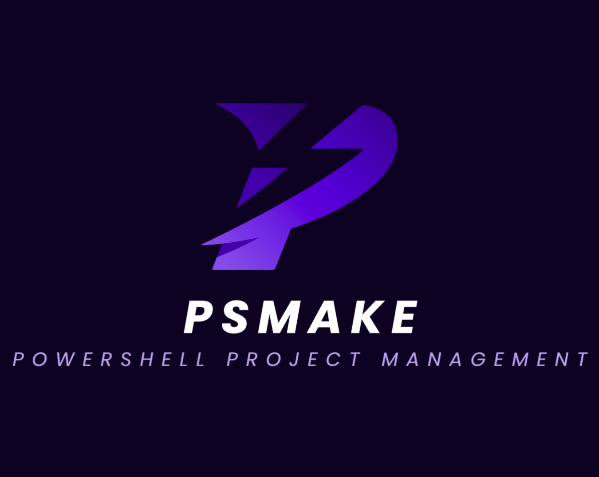

# PSMake
## PowerShell Project Management and Lifecycle


PSMake is an all-in-one project management and lifecycle toolset for PowerShell.

### ❗NOTICE ❗
Please see the [NOTICE](./NOTICE) regarding copyright and ownership information as it
_highly_ affects the [LICENSE](./LICENSE).

### Traditional PowerShell Module Development Problems
1. Only a Manifest (psd1) and module file (psm1) with all logic in one file
2. No seperation of development and production - *Unit Tests distributed to users?* 😬
3. Separating the functions into individual ps1 files and dotsourcing them creates a nightmare for code signing
4. Code signing breaks every time there is a change and PowerShell refuses to import the module.
6. Getting around these issues is up to each project to create their own solutions making every project a unique with no known conventions - *You can't automate without standards and conventions*


### Highlights
Creates the standards and conventions lacking the traditional PowerShell development without being too rigid. Conventions and behaviors can be changed per project without breaking known usages of PSMake.
1. Project is made of seperate function scripts (ps1 files) within the *functions* folder allowing for custom scoping - *no more implicit global scope*
2. Unit test files are in a seperate *tests* folder that run on the development version of the module. *No more distributing the unit tests to users*
3. Generates a distributable version of the module in a flexible, easy-to-read build manifest file (build.psd1)
4. Capable of code signing output files for a given target (Debug, Release, Prerelease).
5. Able to scaffold new projects without any changes necessary - *turn-key ready*.

### Who should use this?
Any PowerShell script project should use this whether simple or complex. Binary modules written in C# can also use it, but may not be necessary.

### Examples
#### Create a new project
```pwsh
PS> PSMake template MyProjectName
```

#### Build release version of the module
```pwsh
PS> PSMake # Default parameters are 'build Release'
```
```pwsh
PS> PSMake build Release
```

#### Build Debug version of the module
```pwsh
PS> PSMake build Debug
```

#### Run unit tests on the module
```pwsh
PS> PSMake test
```

#### Run unit tests, but pass a parameter for reports (code coverage and test result xml files)
```pwsh
PS> PSMake test reports
```

#### Clean the project (removes the distribution (dist) folder containing the generated module)
```pwsh
PS> PSMake clean
```

#### Publish the release version of the module
```pwsh
PS> PSMake publish 'Your-NuGet-API-Key'
```

### Customizing the project workflow - build.psd1
PSD1 files are a text document containing a PowerShell hashtable (```@{}```) with *keys* being set equal to a *value*.

The ```build.psd1``` file is a PowerShell hashtable with expected keys. Some keys are required while others are optional with an implicit default value. A ```build.psd1``` can be generated using the [Create a new Project](#create-a-new-project) example. The generated file contains all available keys and documentation on its behavior and expected type.

The workflow keys are ```Build```, ```Clean```, ```Test```, and ```Publish``` with each assigned to a scriptblock (```{}```) literal. This scriptblock is called in the scope of the PSMake module giving access to the special commands that express the build intent.

#### Special Commands

<table>
<tr>
<td>Command</td>
<td>Description</td>
<td>Example</td>
</tr>
<tr>
<td>AddType</td>
<td>Adds a C# file using Add-Type to the psm1 file</td>
<td>

```pwsh
AddType {
    'classes/MyClass.cs'
}
```
</td>
</tr>
<tr>
<td>CodeSign</td>
<td>Code signs the returns files from the given scriptblock</td>
<td>

```pwsh
CodeSign {
    'file1'
    'file2'
}
```
</td>
</tr>
<tr>
<td>Collate</td>
<td>Brings multiple function ps1 files into a single psm1 file</td>
<td>

```pwsh
Collate {
    './functions/file1.ps1'
    './functions/file2.ps1'
}
```
</td>
</tr>
<tr>
<td>CopyDirectory</td>
<td>Copies directories into the distribution folder</td>
<td>

```pwsh
CopyDirectory {
    './functions'
}
```
</td>
</tr>
<tr>
<td>CopyFiles</td>
<td>Copies files into the distribution folder</td>
<td>

```pwsh
CopyFiles {
    'manifest.psd1'
}
```
</td>
</tr>
<tr>
<td>CreateDirectory</td>
<td>Creates a directory in the distribution folder</td>
<td>

```pwsh
CreateDirectory {
    'MyFolder'
}
```
</td>
</tr>
<tr>
<td>CustomCode</td>
<td>Adds codes to the generated psm1 file in the distribution folder</td>
<td>

```pwsh
CustomCode {
    # Add custom code here
}
```
</td>
</tr>
<tr>
<td>Debug</td>
<td>Only runs the given scriptblock when the build target is Debug</td>
<td>

```pwsh
Debug {
    CopyFiles {
        'module.psm1'
    }
}
```
</td>
</tr>
<tr>
<td>Release</td>
<td>Only runs the given scriptblock when the build target is Release. Also provides a <code>-AndPrerelease</code> switch to run for release AND prerelease targets</td>
<td>

```pwsh
Release {
    Collate {
        Get-ChildItem ./functions/*.ps1
    }
} -AndPrerelease
```

</td>
</tr>
<tr>
<td>Prerelease</td>
<td>Only runs the given scripblock when the build target is Prerelease</td>
<td>

```pwsh
Prerelease {
    SetPrereleaseTag {
        'MyModuleManifest.psd1'
    }
}
```
</td>
</tr>
<tr>
<td>SetPrereleaseTag</td>
<td>Sets the Prerelease property within a manifest file to mark the module as a prerelease within PSResourceGet or PowerShellGet</td>
<td>

```pwsh
SetPrereleaseTag {
    'MyModuleManifest.psd1'
}
```
</td>
</tr>
<tr>
<td>UsingModule</td>
<td>Adds a <code>using module</code> command to the generated psm1 file</td>
<td>

```pwsh
UsingModule {
    'MySpecialModule'
}
```
</td>
</tr>
</table>

### Contributing
PSMake is open to community contributions! Please read the [CONTRIBUTING.md](./CONTRIBUTING.md) file for details on how to contribute!
